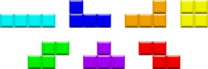
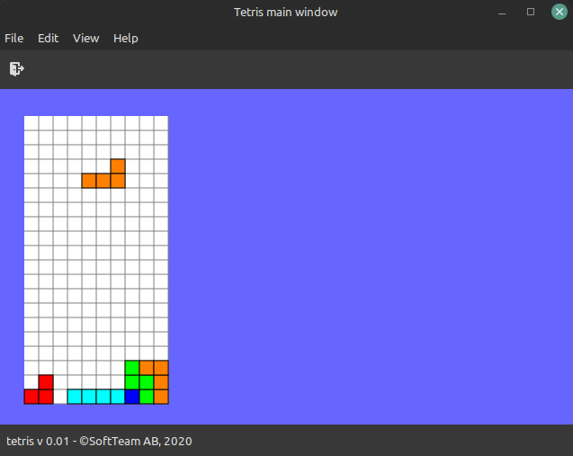

# TETRIS

A simple GTK tetris game

## LINKS

* Tetris rules (guide lines) : https://tetris.fandom.com/wiki/Tetris_Guideline
* Application icon author : <a href="https://www.flaticon.com/free-icons/tetris" title="tetris icons">Tetris icons created by Darius Dan - Flaticon</a>

## TETROMINOS

[image from https://tetris.fandom.com/wiki/Tetromino]

## SCREENSHOT

## TODO

* TODO : Speed (Completed rows/time/dropped tetrominos...)
* TODO : Score (completed rows/time/dropped tetrominos...)
* TODO : Quit should only quit the game, not the application
* BUG : You should be able to move a piece at row 0
* BUG : Occasionally after rotation the tetrominos overlap  
* BUG : There is no working stop function when the fallen tetrominos go over lvl 20
* BUG : Rotation should occur around a center block
 