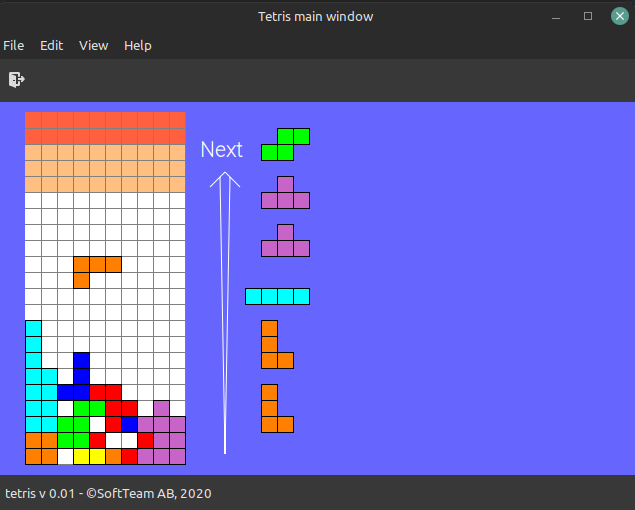

# TETRIS

A simple GTK tetris game

## LINKS

* Tetris rules (guide lines) : https://tetris.fandom.com/wiki/Tetris_Guideline
* Application icon author : <a href="https://www.flaticon.com/free-icons/tetris" title="tetris icons">Tetris icons created by Darius Dan - Flaticon</a>

## TETROMINOS

[image from https://tetris.fandom.com/wiki/Tetromino]

## SCREENSHOT

## TODO

* Speed (Completed rows/time/dropped tetrominos...)
* Score (completed rows/time/dropped tetrominos...)
* Movie piece at row 0
* Quit should only quit the game, not the application
* 